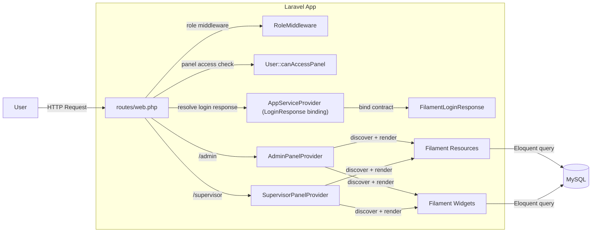
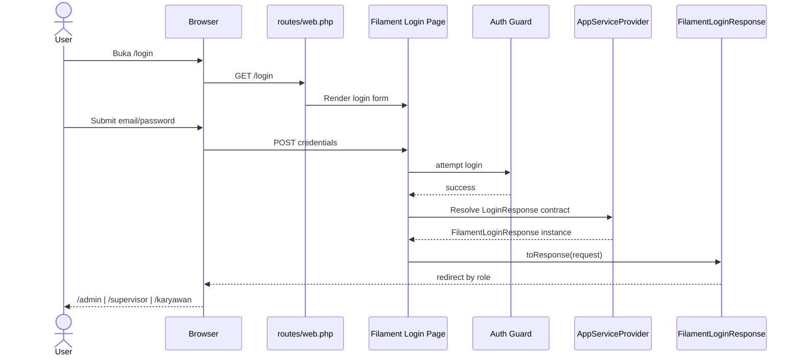
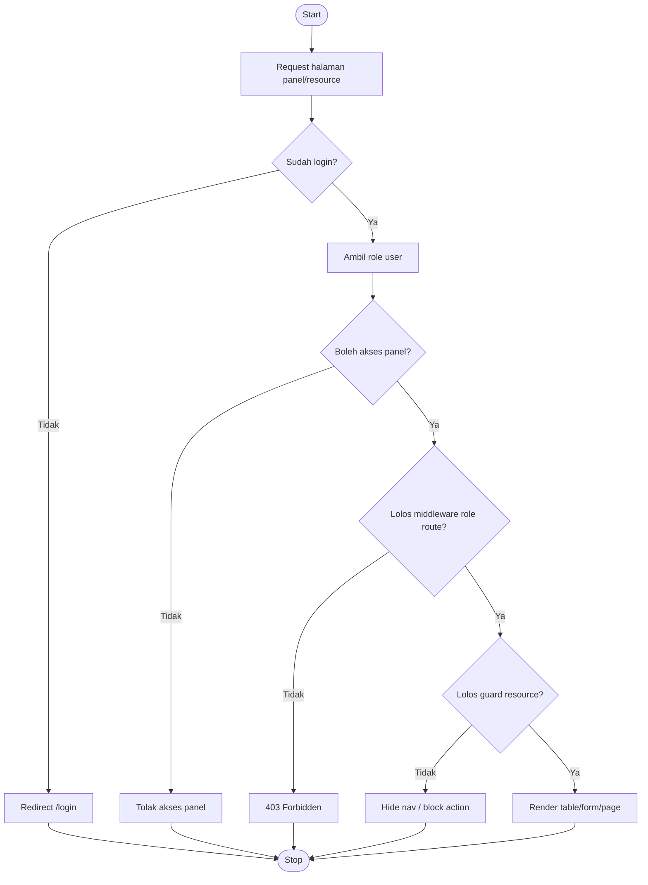

# Cara Kerja Filament + Detail File (Dengan Mermaid)

Tanggal update: 2026-04-27

Dokumen ini fokus ke dua hal:
- cara kerja Filament di aplikasi ini dari request masuk sampai halaman tampil
- cara kerja file kunci secara detail (apa perannya, kapan dipanggil, dampaknya)

## 1) End-to-End Cara Kerja Filament di Project Ini

## Step 1: App Bootstrap

Saat app boot:
- `bootstrap/providers.php` mendaftarkan provider:
  - `AppServiceProvider`
  - `AdminPanelProvider`
  - `SupervisorPanelProvider`
- `bootstrap/app.php` mendaftarkan alias middleware `role` -> `RoleMiddleware`

Dampak:
- panel Filament kebaca
- middleware role siap dipakai di route web

## Step 2: Request Masuk ke Route

Route utama ada di `routes/web.php`:
- `/` -> redirect berdasarkan status login + role
- `/login` -> pakai halaman login Filament (`Filament\Auth\Pages\Login`)
- `/karyawan/*` -> route mobile karyawan yang diproteksi auth + role

Dampak:
- semua user masuk lewat alur login yang sama
- tiap role diarahkan ke area yang benar

## Step 3: Proses Login Filament

Saat login berhasil:
- Filament resolve contract `LoginResponse`
- binding contract dilakukan di `app/Providers/AppServiceProvider.php`
- implementation yang dipakai: `app/Http/Responses/FilamentLoginResponse.php`

Dampak:
- redirect after-login jadi custom dan role-aware:
  - admin -> `/admin`
  - supervisor -> `/supervisor`
  - karyawan -> `karyawan.beranda`

## Step 4: Cek Akses Panel

Model `User` mengimplementasikan `FilamentUser` dengan method:
- `canAccessPanel(Panel $panel)` di `app/Models/User.php`

Dampak:
- sistem memutuskan user boleh masuk panel mana

## Step 5: Panel Build Resource/Page/Widget

Masing-masing panel provider melakukan:
- discover resources (`app/Filament/Resources`)
- discover pages (`app/Filament/Pages`)
- discover widgets (`app/Filament/Widgets`)
- pasang middleware panel + authMiddleware role

Dampak:
- panel admin dan supervisor punya resource set yang sama, tapi akses final tetap disaring oleh guard di level resource

## Step 6: Guard di Level Resource

Di tiap `*Resource.php`, method seperti ini menentukan CRUD access:
- `canViewAny`
- `canCreate`
- `canEdit`
- `canDelete`
- `shouldRegisterNavigation` (opsional)

Dampak:
- meskipun panel sama-sama discover resource, apa yang benar-benar tampil dan bisa diakses tetap tergantung role logic di resource

## 2) Detail Cara Kerja File Kunci

## A. Core Routing & Auth

| File | Kapan Dieksekusi | Tanggung Jawab | Kalau Diubah, Cek Ini |
|---|---|---|---|
| `routes/web.php` | Tiap request web masuk | Route root, login, route karyawan, role middleware route-level | Redirect role, middleware `role:*`, dan name route |
| `app/Http/Responses/FilamentLoginResponse.php` | Sesudah login sukses | Menentukan landing page per role | Mapping role->URL jangan typo |
| `app/Providers/AppServiceProvider.php` | Saat service container boot/register | Bind contract Filament login response ke class custom | Pastikan binding class tetap valid |
| `app/Models/User.php` | Saat auth/session/akses panel | `canAccessPanel`, relasi user-role domain | Akses panel admin/supervisor sesuai ekspektasi |
| `app/Http/Middleware/RoleMiddleware.php` | Saat route pakai middleware `role` | Validasi role route-level + response unauthorized/forbidden | Behavior web vs API response |
| `bootstrap/app.php` | Bootstrap aplikasi | Registrasi alias middleware `role` | Alias middleware tidak putus |
| `bootstrap/providers.php` | Bootstrap provider | Registrasi provider panel | Panel provider kebaca saat app start |

## B. Panel Provider

| File | Kapan Dieksekusi | Tanggung Jawab | Kalau Diubah, Cek Ini |
|---|---|---|---|
| `app/Providers/Filament/AdminPanelProvider.php` | Saat build panel admin | ID panel, path `/admin`, middleware, discover resources/widgets | Login/akses admin, dashboard dan nav |
| `app/Providers/Filament/SupervisorPanelProvider.php` | Saat build panel supervisor | ID panel, path `/supervisor`, middleware, discover resources/widgets | Login/akses supervisor, dashboard dan nav |

## C. Resource Layer (Pattern)

Pattern umum 1 resource:
- `.../<Resource>Resource.php`
  - model, permission methods, page registry
- `.../Schemas/*Form.php`
  - field create/edit
- `.../Schemas/*Infolist.php`
  - detail record
- `.../Tables/*Table.php`
  - kolom table, filter, action
- `.../Pages/*.php`
  - list/create/edit/view page class

Flow saat user buka halaman resource:
1. Panel route ke page class (`Pages/List*.php` dsb)
2. Page minta config dari resource
3. Resource jalankan permission guard
4. Schema/table di-render dari file schema/table

## D. Widget Layer

| File | Tugas |
|---|---|
| `app/Filament/Widgets/AttendanceRealtimeStatsWidget.php` | Hitung statistik presensi realtime dan tampilkan stat cards |
| `app/Filament/Widgets/LaporanEvaluasiChartWidget.php` | Query agregat laporan dan render chart evaluasi |
| `app/Filament/Widgets/KaryawanQuickAccessWidget.php` | Quick links khusus role karyawan |
| `resources/views/filament/widgets/karyawan-quick-access-widget.blade.php` | Tampilan visual quick access |

## 3) Mermaid Diagram

## A. Component Diagram (Arsitektur Inti)

## B. Sequence Diagram (Login Sampai Redirect Role)

## C. Activity Diagram (Decision Akses)

## 4) Setup Render Mermaid

Mermaid tidak butuh `plantuml.jar`, jadi lebih simpel.

### Opsi A (Direkomendasikan): Preview langsung di VS Code

1. Buka file ini.
2. Jalankan preview markdown.
3. Pastikan block diagram pakai fenced code `mermaid`.

### Opsi B: Render via Mermaid Live Editor

Kalau preview lokal extension bermasalah, paste diagram ke:
- https://mermaid.live

### Troubleshooting cepat

1. Pastikan opener code block adalah `mermaid`, bukan `plantuml`.
2. Update extension Markdown Preview Enhanced / Markdown viewer.
3. Reload window VS Code setelah update extension.

## 5) Checklist Saat Ubah Behavior

1. Ubah file target sesuai layer (route/panel/resource/widget).
2. Cek mapping role di 3 layer:
   - panel (`canAccessPanel`)
   - middleware route (`role:*`)
   - resource permission methods
3. Validasi cepat:
   - `php -l <file>`
   - `php artisan route:list --path=login`
4. Smoke test manual:
   - login admin, supervisor, karyawan
   - akses panel masing-masing
   - pastikan action CRUD sesuai role

## 6) Kapan Pakai Dokumen Ini

- Lagi onboarding dev baru ke proyek Filament ini.
- Lagi debug 403/redirect yang nyasar.
- Lagi refactor role access dan butuh lihat dependency antar file.
