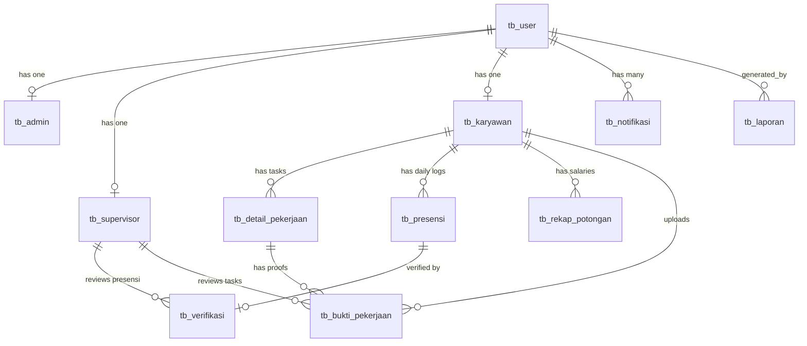

# Skema Database & Model Relasi
## Sistem Informasi Kepegawaian — CV Boss Muda Mandiri

---

## 1. Daftar Tabel Database

Sistem menggunakan **14 tabel migrasi** dengan prefiks `tb_` pada tabel bisnis utama.

| No | Nama Tabel | Deskripsi | Model |
|----|-----------|-----------|-------|
| 1 | `tb_user` | Data autentikasi & profil semua pengguna | `User` |
| 2 | `tb_admin` | Data tambahan admin (NIP, divisi) | `Admin` |
| 3 | `tb_supervisor` | Data tambahan supervisor (jabatan) | `Supervisor` |
| 4 | `tb_karyawan` | Data lengkap karyawan (NIK, posisi, kontrak) | `Karyawan` |
| 5 | `tb_detail_pekerjaan` | Daftar tugas harian (task list) | `DetailPekerjaan` |
| 6 | `tb_presensi` | Catatan presensi harian (1x per hari) | `Presensi` |
| 7 | `tb_verifikasi` | Hasil verifikasi supervisor terhadap presensi | `Verifikasi` |
| 8 | `tb_bukti_pekerjaan` | Foto before/after hasil kerja per tugas | `BuktiPekerjaan` |
| 9 | `tb_rekap_potongan` | Rekap gaji & potongan per periode | `RekapPotongan` |
| 10 | `tb_laporan` | Metadata laporan yang di-generate | `Laporan` |
| 11 | `tb_notifikasi` | Notifikasi untuk semua user | `Notifikasi` |
| 12 | `tb_setting` | Pengaturan sistem (key-value) | `Setting` |
| 13 | `sessions` | Session management Laravel | - |
| 14 | `cache` | Cache framework | - |

---

## 2. Struktur Kolom per Tabel

### 2.1 `tb_user`
| Kolom | Tipe | Keterangan |
|-------|------|------------|
| id | bigint PK | Auto increment |
| nama | varchar(255) | Nama lengkap |
| email | varchar(255) UNIQUE | Email login |
| password | varchar(255) | Hashed password |
| role | enum('admin','supervisor','karyawan') | Peran pengguna |
| is_active | boolean | Status aktif akun |
| remember_token | varchar(100) | Token "Remember Me" |
| created_at | timestamp | Waktu pembuatan |

### 2.2 `tb_admin`
| Kolom | Tipe | Keterangan |
|-------|------|------------|
| id | bigint PK | Auto increment |
| user_id | bigint FK → tb_user.id | Relasi ke user |
| nip | varchar(255) | Nomor Induk Pegawai |
| divisi | varchar(255) | Divisi kerja |
| level_akses | varchar(255) | Level akses (penuh/menengah) |
| created_at | timestamp | Waktu pembuatan |

### 2.3 `tb_supervisor`
| Kolom | Tipe | Keterangan |
|-------|------|------------|
| id | bigint PK | Auto increment |
| user_id | bigint FK → tb_user.id | Relasi ke user |
| jabatan | varchar(255) | Jabatan supervisor |
| level_akses | varchar(255) | Level akses |
| created_at | timestamp | Waktu pembuatan |

### 2.4 `tb_karyawan`
| Kolom | Tipe | Keterangan |
|-------|------|------------|
| id | bigint PK | Auto increment |
| user_id | bigint FK → tb_user.id | Relasi ke user |
| nik | varchar(255) UNIQUE | NIK karyawan internal |
| posisi_karyawan | varchar(255) | Jabatan/posisi |
| no_ktp | varchar(255) nullable | Nomor KTP |
| no_hp | varchar(30) | Nomor telepon |
| alamat | text nullable | Alamat rumah |
| foto | varchar(255) nullable | Path foto profil |
| tgl_masuk | date | Tanggal mulai kerja |
| status_kontrak | varchar(255) | tetap / kontrak / freelance |
| bidang_tugas | varchar(255) | Bidang tugas utama |
| gaji_pokok | decimal(15,2) nullable | Gaji pokok bulanan |
| created_at | timestamp | Waktu pembuatan |

### 2.5 `tb_detail_pekerjaan` (Daftar Tugas)
| Kolom | Tipe | Keterangan |
|-------|------|------------|
| id | bigint PK | Auto increment |
| karyawan_id | bigint FK → tb_karyawan.id | Karyawan yang ditugaskan |
| tanggal | date | Tanggal penugasan |
| jam_masuk | time | Jam mulai kerja |
| jam_pulang | time | Jam selesai kerja |
| nama_lokasi | varchar(255) | Nama tempat kerja |
| alamat_lokasi | text nullable | Alamat lengkap |
| latitude | decimal(10,7) nullable | Koordinat GPS latitude |
| longitude | decimal(10,7) nullable | Koordinat GPS longitude |
| radius_meter | integer | Radius validasi (meter) |
| keterangan_pekerjaan | text nullable | Deskripsi tugas |
| status | enum('pending', 'disetujui', 'ditolak') | Respon karyawan terhadap tugas |
| alasan_tolak | text nullable | Alasan jika karyawan menolak tugas |
| created_at | timestamp | Waktu pembuatan |

### 2.6 `tb_presensi` (Harian)
| Kolom | Tipe | Keterangan |
|-------|------|------------|
| id | bigint PK | Auto increment |
| karyawan_id | bigint FK → tb_karyawan.id | Karyawan |
| tgl_presensi | date | Tanggal presensi |
| jam_masuk | datetime nullable | Waktu check-in (di Kantor Pusat) |
| jam_pulang | datetime nullable | Waktu check-out |
| status | varchar(255) | hadir/terlambat/tidak_hadir/izin |
| foto_masuk | varchar(255) nullable | Path foto check-in (selfie) |
| foto_keluar | varchar(255) nullable | Path foto check-out |
| lat_masuk | decimal(10,7) nullable | Latitude saat check-in |
| long_masuk | decimal(10,7) nullable | Longitude saat check-in |
| durasi_menit | integer nullable | Total jam kerja |
| keterlambatan_menit | integer default 0 | Menit keterlambatan dari 08:00 |
| potongan | decimal(15,2) default 0 | Nominal potongan otomatis |
| created_at | timestamp | Waktu pembuatan |

### 2.7 `tb_verifikasi`
| Kolom | Tipe | Keterangan |
|-------|------|------------|
| id | bigint PK | Auto increment |
| presensi_id | bigint FK → tb_presensi.id UNIQUE | Presensi yang diverifikasi |
| supervisor_id | bigint FK → tb_supervisor.id | Supervisor yang memverifikasi |
| status | varchar(255) | pending/disetujui/ditolak |
| catatan | text nullable | Catatan supervisor |
| tgl_verifikasi | datetime nullable | Waktu verifikasi |
| alasan_tolak | varchar(255) nullable | Alasan penolakan |
| created_at | timestamp | Waktu pembuatan |

### 2.8 `tb_bukti_pekerjaan` (Per Tugas)
| Kolom | Tipe | Keterangan |
|-------|------|------------|
| id | bigint PK | Auto increment |
| detail_pekerjaan_id | bigint FK → tb_detail_pekerjaan.id | Tugas terkait |
| karyawan_id | bigint FK → tb_karyawan.id | Karyawan pengirim |
| foto_before | varchar(255) nullable | Foto sebelum dikerjakan |
| foto_after | varchar(255) nullable | Foto sesudah dikerjakan |
| keterangan | text nullable | Deskripsi hasil kerja |
| status | varchar(255) default 'pending' | Status persetujuan Admin/Supervisor |
| uploaded_at | datetime nullable | Waktu upload |
| created_at | timestamp | Waktu pembuatan |

### 2.9 `tb_rekap_potongan`
| Kolom | Tipe | Keterangan |
|-------|------|------------|
| id | bigint PK | Auto increment |
| karyawan_id | bigint FK → tb_karyawan.id | Karyawan |
| admin_id | bigint FK → tb_admin.id NULL | Admin yang generate |
| periode | varchar(255) | Format YYYY-MM |
| jumlah_hadir | integer default 0 | Total hari hadir |
| jumlah_tidak_hadir | integer default 0 | Total hari tidak hadir |
| jumlah_terlambat | integer default 0 | Total hari terlambat |
| total_potongan_keterlambatan | decimal(12,2) default 0 | Total potongan |
| gaji_pokok | decimal(12,2) default 0 | Gaji pokok |
| gaji_bersih | decimal(12,2) default 0 | Gaji bersih |
| catatan | text nullable | Catatan admin |
| status | enum('draft','final','dibatalkan') | Status rekap |
| created_at | timestamp | Waktu pembuatan |
| updated_at | timestamp | Waktu update |

### 2.10 `tb_laporan`
| Kolom | Tipe | Keterangan |
|-------|------|------------|
| id | bigint PK | Auto increment |
| judul | varchar(255) nullable | Judul laporan (auto-generated) |
| jenis | varchar(255) nullable | Harian/Mingguan/Bulanan/Tahunan |
| periode | varchar(255) nullable | Periode laporan |
| filter | text nullable | JSON filter/catatan |
| file_path | varchar(255) nullable | Path file laporan |
| generated_by | bigint FK → tb_user.id | User yang membuat |
| tgl_generate | datetime | Tanggal generate |
| created_at | timestamp | Waktu pembuatan |

### 2.11 `tb_notifikasi`
| Kolom | Tipe | Keterangan |
|-------|------|------------|
| id | bigint PK | Auto increment |
| user_id | bigint FK → tb_user.id | Penerima notifikasi |
| tipe | varchar(255) | info/urgent/peringatan |
| pesan | text | Isi pesan notifikasi |
| terbaca | boolean default false | Status sudah dibaca |
| tgl_kirim | datetime | Waktu kirim |
| channel | varchar(255) | Channel notifikasi |
| created_at | timestamp | Waktu pembuatan |

### 2.12 `tb_setting`
| Kolom | Tipe | Keterangan |
|-------|------|------------|
| id | bigint PK | Auto increment |
| key | varchar(255) UNIQUE | Kunci setting |
| value | text nullable | Nilai setting |
| created_at | timestamp | Waktu pembuatan |
| updated_at | timestamp | Waktu update |

---

## 3. Diagram Relasi Antar Model (ERD)

---

## 4. Catatan Penting Relasi

1. **Pemisahan Presensi & Tugas**: `tb_presensi` sekarang bersifat harian (log masuk/pulang di kantor pusat), sedangkan `tb_bukti_pekerjaan` terikat langsung ke `tb_detail_pekerjaan` (tugas spesifik).
2. **Accept/Reject Mechanism**: `tb_detail_pekerjaan` memiliki status `pending`, `disetujui`, atau `ditolak` yang ditentukan oleh karyawan saat menerima tugas.
3. **Karyawan → BuktiPekerjaan**: One-to-many. Karyawan mengunggah bukti (before/after) untuk setiap tugas yang mereka selesaikan.
4. **Presensi → Verifikasi**: Relasi one-to-one untuk validasi kehadiran oleh supervisor.
