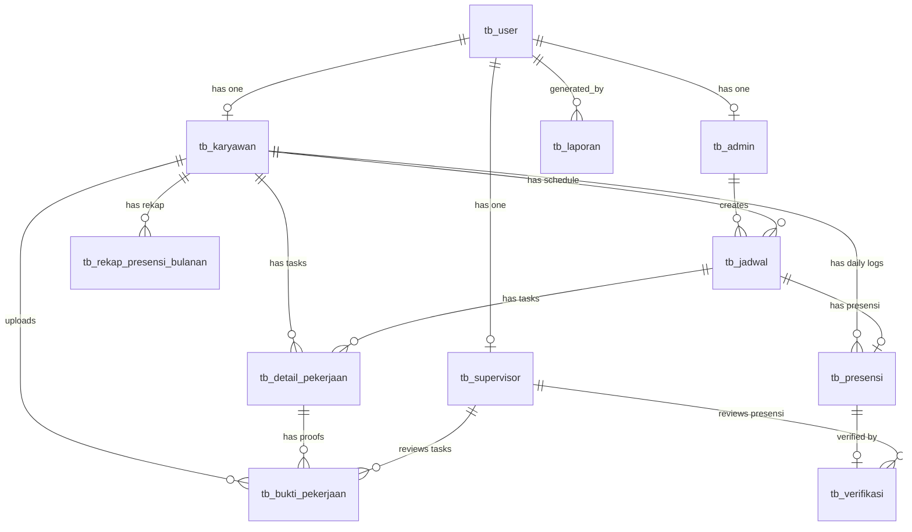

# Skema Database & Model Relasi

## Sistem Informasi Kepegawaian — CV Boss Muda Mandiri

---

## 1. Daftar Tabel Database

Sistem menggunakan **14 tabel migrasi** dengan prefiks `tb_` pada tabel bisnis utama.

| No  | Nama Tabel                  | Deskripsi                                                                                                                                 | Model                  |
| --- | --------------------------- | ----------------------------------------------------------------------------------------------------------------------------------------- | ---------------------- |
| 1   | `tb_user`                   | Data autentikasi & profil semua pengguna                                                                                                  | `User`                 |
| 2   | `tb_admin`                  | Data tambahan admin (NIK, no_hp)                                                                                                          | `Admin`                |
| 3   | `tb_supervisor`             | Data tambahan supervisor (NIK, no_hp)                                                                                                     | `Supervisor`           |
| 4   | `tb_karyawan`               | Data lengkap karyawan (NIK, posisi, kontrak)                                                                                              | `Karyawan`             |
| 5   | `tb_jadwal`                 | Jadwal kerja per karyawan per tanggal                                                                                                     | `Jadwal`               |
| 6   | `tb_detail_pekerjaan`       | Daftar tugas per jadwal                                                                                                                   | `DetailPekerjaan`      |
| 7   | `tb_presensi`               | Catatan presensi harian (1x per hari)                                                                                                     | `Presensi`             |
| 8   | `tb_verifikasi`             | Hasil verifikasi supervisor terhadap presensi                                                                                             | `Verifikasi`           |
| 9   | `tb_bukti_pekerjaan`        | Foto before/after hasil kerja per tugas                                                                                                   | `BuktiPekerjaan`       |
| 10  | `tb_rekap_presensi_bulanan` | Rekap presensi bulanan (potongan keterlambatan) per periode — di UI ditampilkan sebagai **"Laporan Jumlah Presensi Per Karyawan"** (V2.3) | `RekapPresensiBulanan` |
| 11  | `tb_laporan`                | Metadata laporan yang di-generate                                                                                                         | `Laporan`              |
| 12  | `tb_setting`                | Pengaturan sistem (key-value)                                                                                                             | `Setting`              |
| 13  | `sessions`                  | Session management Laravel                                                                                                                | -                      |
| 14  | `cache`                     | Cache framework                                                                                                                           | -                      |

---

## 2. Struktur Kolom per Tabel

### 2.1 `tb_user`

| Kolom          | Tipe                                  | Keterangan          |
| -------------- | ------------------------------------- | ------------------- |
| id             | bigint PK                             | Auto increment      |
| nama           | varchar(255)                          | Nama lengkap        |
| email          | varchar(255) UNIQUE                   | Email login         |
| password       | varchar(255)                          | Hashed password     |
| role           | enum('admin','supervisor','karyawan') | Peran pengguna      |
| is_active      | boolean                               | Status aktif akun   |
| remember_token | varchar(100)                          | Token "Remember Me" |
| created_at     | timestamp                             | Waktu pembuatan     |

### 2.2 `tb_admin`

| Kolom      | Tipe                   | Keterangan                   |
| ---------- | ---------------------- | ---------------------------- |
| id         | bigint PK              | Auto increment               |
| user_id    | bigint FK → tb_user.id | Relasi ke user               |
| nik        | varchar(255)           | Nomor Induk Karyawan (Admin) |
| no_hp      | varchar(30)            | Nomor telepon                |
| created_at | timestamp              | Waktu pembuatan              |

### 2.3 `tb_supervisor`

| Kolom      | Tipe                   | Keterangan                        |
| ---------- | ---------------------- | --------------------------------- |
| id         | bigint PK              | Auto increment                    |
| user_id    | bigint FK → tb_user.id | Relasi ke user                    |
| nik        | varchar(255)           | Nomor Induk Karyawan (Supervisor) |
| no_hp      | varchar(30)            | Nomor telepon                     |
| created_at | timestamp              | Waktu pembuatan                   |

### 2.4 `tb_karyawan`

| Kolom           | Tipe                   | Keterangan                                                         |
| --------------- | ---------------------- | ------------------------------------------------------------------ |
| id              | bigint PK              | Auto increment                                                     |
| user_id         | bigint FK → tb_user.id | Relasi ke user                                                     |
| nik             | varchar(255) UNIQUE    | NIK karyawan internal                                              |
| posisi_karyawan | varchar(255)           | Jabatan/posisi                                                     |
| no_ktp          | varchar(255) nullable  | Nomor KTP                                                          |
| no_hp           | varchar(30)            | Nomor telepon                                                      |
| alamat          | text nullable          | Alamat rumah                                                       |
| foto            | varchar(255) nullable  | Path foto profil                                                   |
| tgl_masuk       | date                   | Tanggal mulai kerja                                                |
| status_kontrak  | varchar(255)           | tetap / kontrak / freelance                                        |
| bidang_tugas    | varchar(255)           | Bidang tugas utama                                                 |
| gaji_pokok      | decimal(15,2) nullable | Gaji pokok bulanan (ada di DB, tidak ditampilkan di UI sejak V2.2) |
| created_at      | timestamp              | Waktu pembuatan                                                    |

### 2.5 `tb_jadwal`

| Kolom         | Tipe                       | Keterangan                |
| ------------- | -------------------------- | ------------------------- |
| id            | bigint PK                  | Auto increment            |
| karyawan_id   | bigint FK → tb_karyawan.id | Karyawan yang dijadwalkan |
| admin_id      | bigint FK → tb_admin.id    | Admin pembuat (nullable)  |
| tanggal_kerja | date                       | Tanggal kerja             |
| jam_masuk     | time                       | Jam mulai kerja           |
| jam_pulang    | time                       | Jam selesai kerja         |
| hari_libur    | boolean                    | Penanda hari libur        |
| status        | enum('aktif','dibatalkan') | Status jadwal             |
| created_at    | timestamp                  | Waktu pembuatan           |

### 2.6 `tb_detail_pekerjaan` (Daftar Tugas)

| Kolom                | Tipe                                    | Keterangan                         |
| -------------------- | --------------------------------------- | ---------------------------------- |
| id                   | bigint PK                               | Auto increment                     |
| jadwal_id            | bigint FK → tb_jadwal.id                | Jadwal kerja terkait               |
| karyawan_id          | bigint FK → tb_karyawan.id              | Karyawan yang ditugaskan           |
| nama_lokasi          | varchar(255)                            | Nama tempat kerja                  |
| alamat_lokasi        | text nullable                           | Alamat lengkap                     |
| latitude             | decimal(10,7) nullable                  | Koordinat GPS latitude             |
| longitude            | decimal(10,7) nullable                  | Koordinat GPS longitude            |
| radius_meter         | integer                                 | Radius validasi (meter)            |
| keterangan_pekerjaan | text nullable                           | Deskripsi tugas                    |
| status               | enum('pending', 'disetujui', 'ditolak') | Respon karyawan terhadap tugas     |
| alasan_tolak         | text nullable                           | Alasan jika karyawan menolak tugas |
| created_at           | timestamp                               | Waktu pembuatan                    |

### 2.7 `tb_presensi` (Harian)

| Kolom              | Tipe                                           | Keterangan                          |
| ------------------ | ---------------------------------------------- | ----------------------------------- |
| id                 | bigint PK                                      | Auto increment                      |
| karyawan_id        | bigint FK → tb_karyawan.id                     | Karyawan                            |
| jadwal_id          | bigint FK → tb_jadwal.id                       | Jadwal terkait (nullable)           |
| tanggal            | date                                           | Tanggal presensi                    |
| jam_masuk          | datetime nullable                              | Waktu check-in (di Kantor Pusat)    |
| jam_keluar         | datetime nullable                              | Waktu check-out                     |
| status_presensi    | enum('hadir','terlambat','tidak_hadir','izin') | Status presensi                     |
| status_valid       | enum('pending','valid','tidak_valid')          | Status validasi                     |
| foto_masuk         | varchar(255) nullable                          | Path foto check-in (selfie)         |
| foto_keluar        | varchar(255) nullable                          | Path foto check-out                 |
| latitude_masuk     | decimal(10,7) nullable                         | Latitude saat check-in              |
| longitude_masuk    | decimal(10,7) nullable                         | Longitude saat check-in             |
| latitude_keluar    | decimal(10,7) nullable                         | Latitude saat check-out             |
| longitude_keluar   | decimal(10,7) nullable                         | Longitude saat check-out            |
| menit_terlambat    | integer default 0                              | Menit keterlambatan dari jam jadwal |
| potongan_terlambat | decimal(10,2) default 0                        | Nominal potongan otomatis           |
| created_at         | timestamp                                      | Waktu pembuatan                     |

### 2.8 `tb_verifikasi`

| Kolom          | Tipe                              | Keterangan                    |
| -------------- | --------------------------------- | ----------------------------- |
| id             | bigint PK                         | Auto increment                |
| presensi_id    | bigint FK → tb_presensi.id UNIQUE | Presensi yang diverifikasi    |
| supervisor_id  | bigint FK → tb_supervisor.id      | Supervisor yang memverifikasi |
| status         | varchar(255)                      | pending/disetujui/ditolak     |
| catatan        | text nullable                     | Catatan supervisor            |
| tgl_verifikasi | datetime nullable                 | Waktu verifikasi              |
| alasan_tolak   | varchar(255) nullable             | Alasan penolakan              |
| created_at     | timestamp                         | Waktu pembuatan               |

### 2.9 `tb_bukti_pekerjaan` (Per Tugas)

| Kolom               | Tipe                               | Keterangan                          |
| ------------------- | ---------------------------------- | ----------------------------------- |
| id                  | bigint PK                          | Auto increment                      |
| detail_pekerjaan_id | bigint FK → tb_detail_pekerjaan.id | Tugas terkait                       |
| karyawan_id         | bigint FK → tb_karyawan.id         | Karyawan pengirim                   |
| foto_before         | varchar(255) nullable              | Foto sebelum dikerjakan             |
| foto_after          | varchar(255) nullable              | Foto sesudah dikerjakan             |
| keterangan          | text nullable                      | Deskripsi hasil kerja               |
| status              | varchar(255) default 'pending'     | Status persetujuan Admin/Supervisor |
| uploaded_at         | datetime nullable                  | Waktu upload                        |
| created_at          | timestamp                          | Waktu pembuatan                     |

### 2.10 `tb_rekap_presensi_bulanan`

| Kolom                        | Tipe                               | Keterangan                                                  |
| ---------------------------- | ---------------------------------- | ----------------------------------------------------------- |
| id                           | bigint PK                          | Auto increment                                              |
| karyawan_id                  | bigint FK → tb_karyawan.id         | Karyawan                                                    |
| admin_id                     | bigint FK → tb_admin.id NULL       | Admin yang generate                                         |
| periode                      | varchar(255)                       | Format YYYY-MM                                              |
| jumlah_hadir                 | integer default 0                  | Total hari hadir                                            |
| jumlah_tidak_hadir           | integer default 0                  | Total hari tidak hadir                                      |
| jumlah_terlambat             | integer default 0                  | Total hari terlambat                                        |
| total_potongan_keterlambatan | decimal(12,2) default 0            | Total potongan                                              |
| gaji_pokok                   | decimal(12,2) default 0            | Gaji pokok (ada di DB, tidak ditampilkan di UI sejak V2.2)  |
| gaji_bersih                  | decimal(12,2) default 0            | Gaji bersih (ada di DB, tidak ditampilkan di UI sejak V2.2) |
| catatan                      | text nullable                      | Catatan admin                                               |
| status                       | enum('draft','final','dibatalkan') | Status rekap                                                |
| created_at                   | timestamp                          | Waktu pembuatan                                             |
| updated_at                   | timestamp                          | Waktu update                                                |

### 2.11 `tb_laporan`

| Kolom        | Tipe                   | Keterangan                      |
| ------------ | ---------------------- | ------------------------------- |
| id           | bigint PK              | Auto increment                  |
| judul        | varchar(255) nullable  | Judul laporan (auto-generated)  |
| jenis        | varchar(255) nullable  | Harian/Mingguan/Bulanan/Tahunan |
| periode      | varchar(255) nullable  | Periode laporan                 |
| filter       | text nullable          | JSON filter/catatan             |
| file_path    | varchar(255) nullable  | Path file laporan               |
| generated_by | bigint FK → tb_user.id | User yang membuat               |
| tgl_generate | datetime               | Tanggal generate                |
| created_at   | timestamp              | Waktu pembuatan                 |

### 2.12 `tb_setting`

| Kolom      | Tipe                | Keterangan      |
| ---------- | ------------------- | --------------- |
| id         | bigint PK           | Auto increment  |
| key        | varchar(255) UNIQUE | Kunci setting   |
| value      | text nullable       | Nilai setting   |
| created_at | timestamp           | Waktu pembuatan |
| updated_at | timestamp           | Waktu update    |

---

## 3. Diagram Relasi Antar Model (ERD)

---

## 4. Catatan Penting Relasi

1. **Pemisahan Presensi & Tugas**: `tb_presensi` sekarang bersifat harian (log masuk/pulang di kantor pusat), sedangkan `tb_bukti_pekerjaan` terikat langsung ke `tb_detail_pekerjaan` (tugas spesifik).
2. **Accept/Reject Mechanism**: `tb_detail_pekerjaan` memiliki status `pending`, `disetujui`, atau `ditolak` yang ditentukan oleh karyawan saat menerima tugas.
3. **Karyawan → BuktiPekerjaan**: One-to-many. Karyawan mengunggah bukti (before/after) untuk setiap tugas yang mereka selesaikan.
4. **Presensi → Verifikasi**: Relasi one-to-one untuk validasi kehadiran oleh supervisor.
