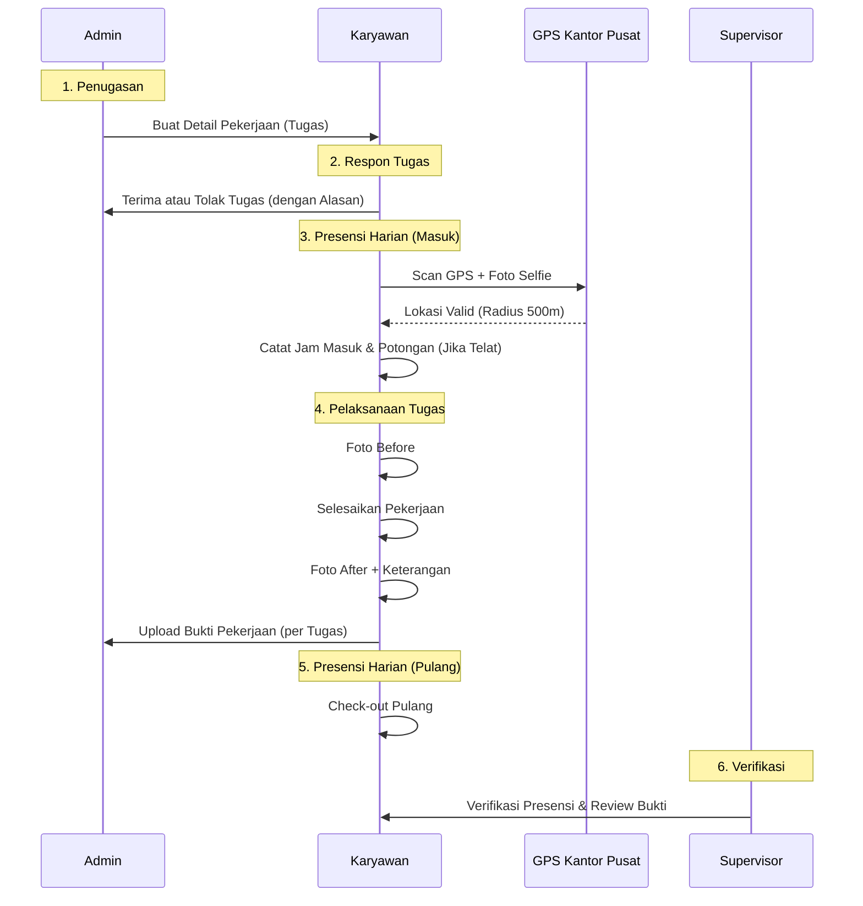

# Fitur & Alur Bisnis per Aktor
## Sistem Informasi Kepegawaian — CV Boss Muda Mandiri

---

## 1. AKTOR: ADMIN

Admin memiliki akses penuh ke seluruh modul sistem melalui Panel Filament (desktop).

### 1.1 Penugasan Kerja (Task Assignment)

**Alur:**
1. Admin membuka menu *Detail Pekerjaan* → klik *Create*.
2. Memilih Karyawan dari dropdown.
3. Mengatur jadwal (tanggal, jam masuk, jam pulang).
4. Menentukan lokasi kerja (nama lokasi & alamat).
5. **Map Picker**: Menentukan titik koordinat lokasi kerja untuk referensi tugas.
6. Status awal tugas adalah **Pending** (menunggu respon karyawan).

### 1.2 Monitoring & Verifikasi
- **Verifikasi Presensi**: Menyetujui atau menolak catatan absensi harian karyawan.
- **Review Bukti Pekerjaan**: Melihat foto before/after yang diunggah karyawan per tugas dan memberikan status (Pending/Disetujui/Ditolak).

---

## 2. AKTOR: KARYAWAN

Karyawan menggunakan **Portal Mobile** untuk aktivitas harian. Alur kerja karyawan kini terbagi menjadi dua bagian: **Presensi Harian** dan **Manajemen Tugas**.

### 2.1 Presensi Harian (Check-in/out)
*Dilakukan 1 kali per hari di Kantor Pusat.*

**Alur Check-in:**
1. Karyawan datang ke Kantor Pusat.
2. Klik "Presensi Masuk" di portal mobile.
3. **Validasi GPS**: Sistem mengecek apakah koordinat karyawan berada dalam radius Kantor Pusat.
4. **Foto Selfie**: Karyawan mengambil foto selfie sebagai bukti kehadiran.
5. Sistem menghitung keterlambatan (toleransi 10 menit dari jam 08:00) dan mencatat potongan otomatis jika terlambat.

**Alur Check-out:**
1. Di akhir jam kerja, karyawan klik "Presensi Pulang".
2. Mencatat jam pulang dan menghitung durasi kerja harian.

### 2.2 Manajemen Tugas (Task Management)
*Dilakukan untuk setiap tugas yang diberikan Admin.*

**Alur Respon Tugas:**
1. Karyawan melihat daftar tugas di menu "Tugas".
2. Untuk tugas berstatus **Pending**, karyawan harus memilih:
   - **Terima Tugas**: Status berubah menjadi "Disetujui" dan karyawan bisa mengerjakan.
   - **Tolak Tugas**: Karyawan wajib mengisi alasan penolakan.

**Alur Upload Bukti Pekerjaan:**
1. Untuk tugas yang sudah diterima, karyawan mengunggah bukti hasil kerja.
2. **Foto Before**: Diambil sebelum pekerjaan dimulai.
3. **Foto After**: Diambil setelah pekerjaan selesai.
4. Mengisi keterangan tambahan tentang hasil kerja.

---

## 3. AKTOR: SUPERVISOR

Supervisor bertugas melakukan **monitoring dan pengawasan** terhadap kinerja karyawan di lapangan. Supervisor **hanya memiliki akses view** (tanpa tombol Buat, Edit, atau Hapus) di seluruh modul Operasional.

### 3.1 Monitoring Kehadiran (View Only)
- Melihat daftar presensi harian karyawan (jam masuk, jam pulang, status, potongan).
- Melihat detail verifikasi yang sudah dilakukan.
- **Tidak bisa** membuat, mengedit, atau menghapus data presensi maupun verifikasi.

### 3.2 Monitoring Penugasan (View Only)
- Melihat daftar tugas (Detail Pekerjaan) yang dibuat oleh admin.
- Melihat bukti pekerjaan (foto before/after) yang diunggah karyawan.
- **Tidak bisa** membuat tugas baru, mengedit, atau menghapus data.

### 3.3 Laporan (View + Export)
- Melihat daftar laporan dan melakukan export (CSV/Excel/PDF).
- **Tidak bisa** membuat atau mengedit laporan.

---

## 4. Alur Bisnis End-to-End (Versi Refactor)

---

## 5. Logika Perhitungan & Validasi

### 5.1 Validasi GPS Kantor Pusat
Sistem memvalidasi koordinat karyawan terhadap titik pusat:
- **Lat**: -6.2087634
- **Lng**: 106.8222568
- **Radius**: 500 Meter

### 5.2 Aturan Keterlambatan
- **Jam Standar**: 08:00 WIB.
- **Toleransi**: 10 Menit (Hingga 08:10).
- **Potongan**: Rp 10.000 setiap kelipatan 10 menit keterlambatan.

### 5.3 Status Pekerjaan
- **Pending**: Menunggu respon karyawan.
- **Disetujui**: Karyawan bersedia mengerjakan.
- **Ditolak**: Karyawan tidak bersedia mengerjakan (Alasan tersimpan).
