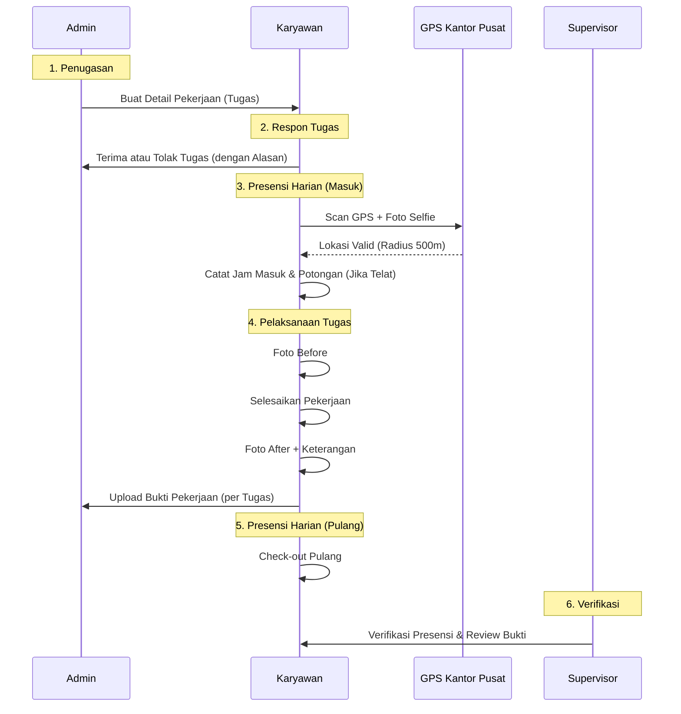

# Fitur & Alur Bisnis per Aktor

## Sistem Informasi Kepegawaian — CV Boss Muda Mandiri

---

## 1. AKTOR: ADMIN

Admin memiliki akses penuh ke seluruh modul sistem melalui Panel Filament (desktop).

### 1.1 Penugasan Kerja (Task Assignment)

**Alur:**

1. Admin membuka menu _Detail Pekerjaan_ → klik _Create_.
2. Memilih Karyawan dari dropdown.
3. Mengatur jadwal (tanggal, jam masuk, jam pulang).
4. Menentukan lokasi kerja (nama lokasi & alamat).
5. **Map Picker**: Menentukan titik koordinat lokasi kerja untuk referensi tugas.
6. Status awal tugas adalah **Pending** (menunggu respon karyawan).

### 1.2 Monitoring & Verifikasi

- **Verifikasi Presensi**: Menyetujui atau menolak catatan absensi harian karyawan.
- **Review Bukti Pekerjaan**: Melihat foto before/after yang diunggah karyawan per tugas dan memberikan status (Pending/Disetujui/Ditolak).

---

## 2. AKTOR: KARYAWAN

Karyawan menggunakan **Portal Mobile** untuk aktivitas harian. Alur kerja karyawan kini terbagi menjadi dua bagian: **Presensi Harian** dan **Manajemen Tugas**.

### 2.1 Presensi Harian (Check-in/out)

_Dilakukan 1 kali per hari di Kantor Pusat._

**Alur Check-in:**

1. Karyawan datang ke Kantor Pusat.
2. Klik "Presensi Masuk" di portal mobile.
3. **Validasi GPS**: Sistem mengecek apakah koordinat karyawan berada dalam radius Kantor Pusat.
4. **Foto Selfie**: Karyawan mengambil foto selfie sebagai bukti kehadiran.
5. Sistem menghitung keterlambatan (toleransi 10 menit dari jam 08:00) dan mencatat potongan otomatis jika terlambat.

**Alur Check-out:**

1. Di akhir jam kerja, karyawan klik "Presensi Pulang".
2. Mencatat jam pulang dan menghitung durasi kerja harian.

### 2.2 Manajemen Tugas (Task Management)

_Dilakukan untuk setiap tugas yang diberikan Admin._

**Alur Respon Tugas:**

1. Karyawan melihat daftar tugas di menu "Tugas".
2. Untuk tugas berstatus **Pending**, karyawan harus memilih:
    - **Terima Tugas**: Status berubah menjadi "Disetujui" dan karyawan bisa mengerjakan.
    - **Tolak Tugas**: Karyawan wajib mengisi alasan penolakan.

**Alur Upload Bukti Pekerjaan:**

1. Untuk tugas yang sudah diterima, karyawan mengunggah bukti hasil kerja.
2. **Foto Before**: Diambil sebelum pekerjaan dimulai.
3. **Foto After**: Diambil setelah pekerjaan selesai.
4. Mengisi keterangan tambahan tentang hasil kerja.

---

## 3. AKTOR: SUPERVISOR

Supervisor bertugas **mengelola presensi karyawan, generate laporan, melakukan verifikasi presensi, dan memantau Laporan Jumlah Presensi Per Karyawan**. Sejak V2.3, hak akses supervisor diperketat menjadi 4 modul inti — modul Karyawan, Jadwal, Detail Pekerjaan, Bukti Pekerjaan, dan Setting tidak tampil di sidebar supervisor.

### 3.1 Kelola Presensi (View Only)

- Melihat daftar presensi harian karyawan (jam masuk, jam pulang, status, potongan).
- **Tidak bisa** membuat, mengedit, atau menghapus data presensi.

### 3.2 Generate Laporan (Create + Export)

- Membuat laporan baru (Presensi Harian / Laporan Jumlah Presensi Per Karyawan / Rekap Pekerjaan).
- Melakukan export per laporan (CSV / Excel / PDF) — PDF menampilkan **spesifikasi jenis laporan** (Harian/Mingguan/Bulanan/Tahunan) di header.
- **Tidak bisa** mengedit atau menghapus laporan yang sudah dibuat (hanya admin).

### 3.3 Verifikasi Presensi (Full CRUD)

- Membuat record verifikasi (Disetujui / Ditolak) terhadap presensi karyawan.
- Mengedit catatan & alasan tolak.
- Menghapus record verifikasi.

### 3.4 Laporan Jumlah Presensi Per Karyawan (View Only)

- Melihat tabel rekap kehadiran per karyawan per periode (jumlah hadir, telat, alpa, total potongan).
- **Tidak bisa** membuat, mengedit, atau menghapus rekap — tombol Create/Edit/Delete/BulkDelete disembunyikan untuk supervisor.

---

## 4. Alur Bisnis End-to-End (Versi Refactor)

---

## 5. Logika Perhitungan & Validasi

### 5.1 Validasi GPS Kantor Pusat

Sistem memvalidasi koordinat karyawan terhadap titik pusat:

- **Lat**: -6.2087634
- **Lng**: 106.8222568
- **Radius**: 500 Meter

### 5.2 Aturan Keterlambatan

- **Jam Standar**: 08:00 WIB.
- **Toleransi**: 10 Menit (Hingga 08:10).
- **Potongan**: **Rp 10.000 per blok 10 menit keterlambatan**, dihitung setelah toleransi. **Tidak ada batas atas** — semakin telat semakin besar potongan.
    - 0–10 menit → Rp 0 (toleransi).
    - 11–20 menit → Rp 10.000.
    - 21–30 menit → Rp 20.000.
    - 31–40 menit → Rp 30.000.
    - 41–50 menit → Rp 40.000, dan seterusnya tanpa cap.
- Potongan dicatat di `presensi.potongan_terlambat` dan diakumulasi di rekap bulanan. **Fitur tampilan gaji tidak aktif sejak V2.2.**

> **Catatan V2.3:** Flat cap Rp 20.000 untuk keterlambatan >30 menit telah dihapus. Rumus murni Rp 10.000/10 menit tanpa batas atas.

### 5.3 Status Pekerjaan

- **Pending**: Menunggu respon karyawan.
- **Disetujui**: Karyawan bersedia mengerjakan.
- **Ditolak**: Karyawan tidak bersedia mengerjakan (Alasan tersimpan).
