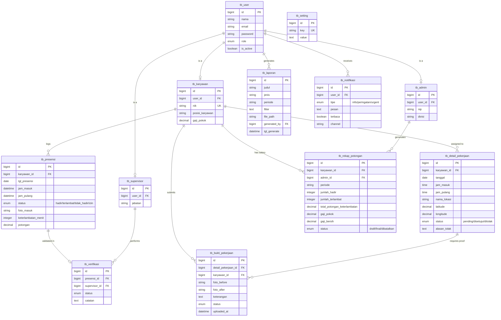

# Diagram Sistem (Use Case & ERD)
## Sistem Informasi Kepegawaian — CV Boss Muda Mandiri

Dokumen ini menyajikan visualisasi arsitektur sistem dalam bentuk Use Case Diagram dan Entity Relationship Diagram (ERD) yang telah disesuaikan dengan *source code* terbaru.

---

## 1. Use Case Diagram

Diagram ini menggambarkan interaksi antara aktor (Admin, Supervisor, Karyawan) dengan fitur-fitur utama di dalam sistem.

```mermaid
useCaseDiagram
    actor Admin
    actor Supervisor
    actor Karyawan

    package "Panel Admin & Supervisor (Filament)" {
        usecase UC1 as "Kelola Akun & Data Master"
        usecase UC2 as "Kelola Penugasan (Detail Pekerjaan)"
        usecase UC3 as "Monitoring Presensi Real-Time"
        usecase UC4 as "Verifikasi Presensi Karyawan"
        usecase UC5 as "Review Bukti Pekerjaan"
        usecase UC6 as "Kelola Rekap Potongan"
        usecase UC7 as "Export Laporan (CSV/Excel/PDF)"
    }

    package "Portal Mobile Karyawan (Blade)" {
        usecase UC8 as "Presensi Masuk (GPS + Selfie)"
        usecase UC9 as "Presensi Pulang"
        usecase UC10 as "Terima/Tolak Penugasan"
        usecase UC11 as "Upload Bukti Pekerjaan (Before/After)"
        usecase UC12 as "Lihat Jadwal & Riwayat"
    }

    %% Relasi Admin
    Admin --> UC1
    Admin --> UC2
    Admin --> UC3
    Admin --> UC4
    Admin --> UC5
    Admin --> UC6
    Admin --> UC7

    %% Relasi Supervisor
    Supervisor --> UC3
    Supervisor --> UC5
    Supervisor --> UC7

    %% Relasi Karyawan
    Karyawan --> UC8
    Karyawan --> UC9
    Karyawan --> UC10
    Karyawan --> UC11
    Karyawan --> UC12
```

---

## 2. Entity Relationship Diagram (ERD)

Diagram ini menunjukkan struktur data dan hubungan antar tabel di database `sistem_kepegawaian`.



---

## 3. Penjelasan Relasi Kunci

1.  **Generalisasi (Role)**: Tabel `tb_user` adalah tabel induk untuk autentikasi, yang terhubung secara One-to-One dengan `tb_admin`, `tb_supervisor`, atau `tb_karyawan`.
2.  **Pemisahan Absensi & Tugas**: 
    - `tb_presensi` mencatat kehadiran harian karyawan di Kantor Pusat.
    - `tb_detail_pekerjaan` mencatat tugas spesifik yang harus diterima/ditolak karyawan.
3.  **Bukti per Tugas**: Relasi antara `tb_detail_pekerjaan` dan `tb_bukti_pekerjaan` memungkinkan karyawan mengunggah banyak laporan hasil kerja dalam satu hari sesuai jumlah tugas yang diberikan.
4.  **Verifikasi Berjenjang**: Setiap log presensi harian diverifikasi oleh Supervisor melalui tabel `tb_verifikasi`.
5.  **Rekap Potongan**: Tabel `tb_rekap_potongan` menghitung gaji bersih per bulan berdasarkan data presensi (hadir/telat/alpa).
6.  **Pengaturan Dinamis**: Tabel `tb_setting` menyimpan konfigurasi sistem secara key-value (lokasi kantor, radius, potongan, dll).
