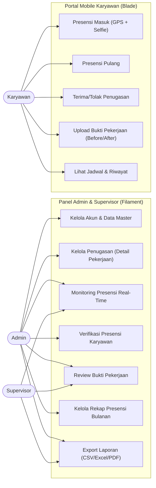
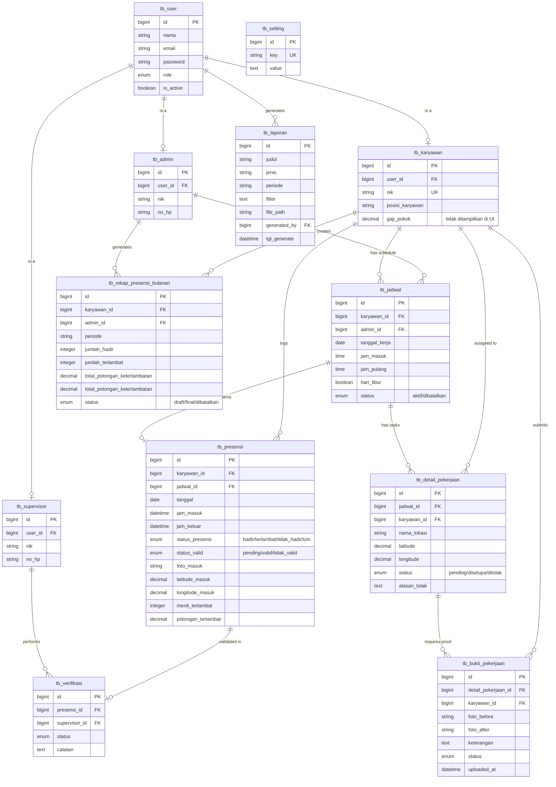

# Diagram Sistem (Use Case & ERD)

## Sistem Informasi Kepegawaian — CV Boss Muda Mandiri

Dokumen ini menyajikan visualisasi arsitektur sistem dalam bentuk Use Case Diagram dan Entity Relationship Diagram (ERD) yang telah disesuaikan dengan _source code_ terbaru.

---

## 1. Use Case Diagram

Diagram ini menggambarkan interaksi antara aktor (Admin, Supervisor, Karyawan) dengan fitur-fitur utama di dalam sistem. Karena renderer Markdown GitHub tidak konsisten mendukung `usecaseDiagram`, visual berikut ditulis sebagai flowchart Mermaid yang setara.

---

## 2. Entity Relationship Diagram (ERD)

Diagram ini menunjukkan struktur data dan hubungan antar tabel di database `sistem_kepegawaian`.

---

## 3. Penjelasan Relasi Kunci

1.  **Generalisasi (Role)**: Tabel `tb_user` adalah tabel induk untuk autentikasi, yang terhubung secara One-to-One dengan `tb_admin`, `tb_supervisor`, atau `tb_karyawan`.
2.  **Pemisahan Absensi & Tugas**:
    - `tb_presensi` mencatat kehadiran harian karyawan di Kantor Pusat.
    - `tb_detail_pekerjaan` mencatat tugas spesifik yang harus diterima/ditolak karyawan.
3.  **Bukti per Tugas**: Relasi antara `tb_detail_pekerjaan` dan `tb_bukti_pekerjaan` memungkinkan karyawan mengunggah banyak laporan hasil kerja dalam satu hari sesuai jumlah tugas yang diberikan.
4.  **Verifikasi Berjenjang**: Setiap log presensi harian diverifikasi oleh Supervisor melalui tabel `tb_verifikasi`.
5.  **Rekap Presensi Bulanan**: Tabel `tb_rekap_presensi_bulanan` merekap potongan keterlambatan per bulan berdasarkan data presensi (hadir/telat/alpa). Kolom `gaji_pokok`/`gaji_bersih` tetap ada di DB namun tidak ditampilkan di UI sejak V2.2.
6.  **Pengaturan Dinamis**: Tabel `tb_setting` menyimpan konfigurasi sistem secara key-value (lokasi kantor, radius, potongan, dll).
