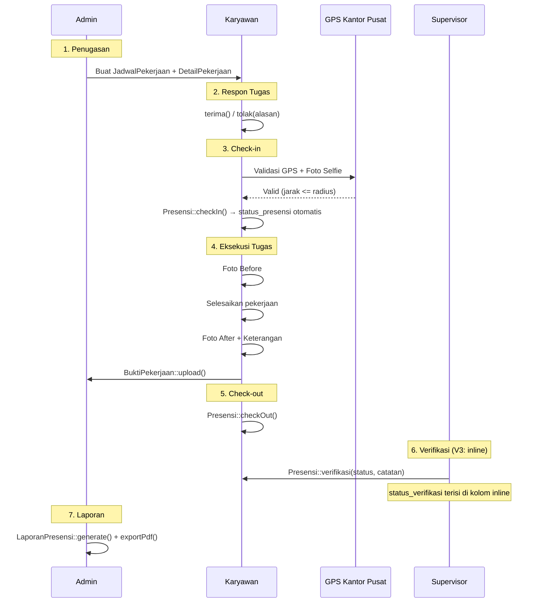

# Fitur & Alur Bisnis V3

## Sistem Informasi Kepegawaian — CV Boss Muda Mandiri

---

## 1. Catatan Penting

Dokumen ini menjelaskan alur bisnis **target arsitektur V3** dengan referensi tabel/class V3 (mis. `tb_jadwal_pekerjaan`, `user_id`, `tb_laporan_presensi`, dll). Semua flow di sini self-contained — tidak perlu cross-reference ke dokumen lain.

Untuk skema database lengkap, lihat [02-database-schema.md](02-database-schema.md). Untuk class diagram OOP, lihat [03-class-diagram-oop.md](03-class-diagram-oop.md).

---

## 2. Aktor Admin

### 2.1 Manajemen User Konsolidasi

V3 menyatukan manajemen Karyawan + Admin + Supervisor ke satu menu **Pengguna** (UserResource) dengan filter by role. Admin tetap bisa:

- **Tambah** akun karyawan/admin/supervisor baru
- **Edit** profil & reset password
- **Aktifkan/Nonaktifkan** akun (`is_active`)
- **Hapus** akun (cascade ke semua data terkait)

### 2.2 Manajemen Jadwal Pekerjaan

Akses via menu **Jadwal Pekerjaan**:

- **Buat jadwal harian** per karyawan dengan jam masuk/pulang custom
- **Buat jadwal massal** (range tanggal sekaligus, skip duplikat)
- **Tandai hari libur** untuk memblok presensi otomatis
- **Default filter hari ini** (V2.3 — tetap di V3)

### 2.3 Manajemen Detail Pekerjaan (Tugas Lapangan)

- **Tambah tugas** per jadwal dengan koordinat GPS + radius
- **Default filter hari ini** via relasi `jadwal.tanggal_kerja`
- Status awal: `pending` (menunggu respon karyawan)

### 2.4 Generate Laporan

Akses via menu **Laporan Presensi**:

- Pilih **tipe**: Laporan Presensi / Laporan Jumlah Presensi Per Karyawan / Rekap Pekerjaan
- Pilih **jenis**: Harian / Mingguan / Bulanan / Tahunan
    - Khusus tipe **Laporan Jumlah Presensi Per Karyawan**: jenis dikunci ke **Bulanan**
- Sistem auto-generate judul + statistik
- Export PDF/Excel/CSV — **header PDF menampilkan jenis**

---

## 3. Aktor Karyawan

### 3.1 Presensi Harian

**Check-in (`Presensi::checkIn`):**

1. Karyawan buka portal mobile `/karyawan`
2. Klik **Presensi Masuk**
3. Sistem ambil koordinat GPS via browser
4. Validasi: jarak ke kantor pusat ≤ radius (default 500m, dari Setting)
5. Karyawan ambil foto selfie via webcam (atau upload)
6. Submit → record `tb_presensi` dibuat:
    - `jam_masuk` = `now()`
    - `foto_masuk` = path foto
    - `latitude_masuk`, `longitude_masuk` = koordinat
    - `menit_terlambat` = `hitungKeterlambatan(jam_masuk, jam_jadwal)`
    - `potongan_terlambat` = `hitungPotongan(menit_terlambat)` (Rp 10.000/blok 10 menit, tanpa cap)
    - `status_presensi` = `hadir` / `terlambat` / `tidak_hadir`
    - `status_verifikasi` = `pending` (menunggu supervisor)

**Check-out (`Presensi::checkOut`):**

1. Klik **Presensi Pulang**
2. Ambil GPS + foto selfie
3. Submit → update record:
    - `jam_keluar` = `now()`
    - `foto_keluar`, `latitude_keluar`, `longitude_keluar`

### 3.2 Workflow Tugas

1. Buka menu **Tugas**
2. Lihat daftar `tb_detail_pekerjaan` (status `pending`)
3. **Terima** tugas (`DetailPekerjaan::terima()`) → status jadi `disetujui`
4. **Tolak** tugas (`DetailPekerjaan::tolak(alasan)`) → status jadi `ditolak` + `alasan_tolak` tersimpan
    - **(V3 enhancement)** Setelah menolak, muncul tombol **"Konfirmasi via WhatsApp"** ke admin dengan template otomatis (perusahaan, nama+NIK, lokasi, tanggal, alasan). Nomor tujuan dari Setting `wa_admin` (bisa diubah di Pengaturan), fallback `no_hp` admin pembuat jadwal; dinormalisasi 08xx→62xx.
5. Setelah diterima: bisa upload **Bukti Pekerjaan**

### 3.3 Upload Bukti Pekerjaan

1. Pilih tugas yang sudah diterima
2. Ambil **Foto Before** (sebelum dikerjakan)
3. Ambil **Foto After** (sesudah selesai)
4. Isi **keterangan**
5. Submit → `BuktiPekerjaan::upload()` membuat record di `tb_bukti_pekerjaan`

### 3.4 Lihat Riwayat

- Riwayat presensi 30 hari terakhir
- Total potongan keterlambatan bulan berjalan
- Status verifikasi tiap presensi (V3: dari kolom `status_verifikasi`)
- Tab Tugas: status tiap penugasan

---

## 4. Aktor Supervisor

### 4.1 Hak Akses Terbatas (V2.3 — Tetap V3)

Menu supervisor di sidebar:

1. **Verifikasi** (antrian presensi `pending` + aksi cepat Setujui/Tolak) — supervisor-only
2. **Presensi** (view-only tabel; verifikasi juga bisa inline dari form Edit)
3. **Laporan Presensi** (generate + export)
4. **Pengaturan** (read-only — lihat konfigurasi, tidak bisa ubah)

> **V3 Note (diperbarui):** Verifikasi kini punya **menu antrian khusus** (`VerifikasiResource`) berisi presensi `pending` yang sudah check-in, dengan tombol cepat Setujui/Tolak. Verifikasi inline di form Edit Presensi tetap tersedia sebagai alternatif. Menu **Pengaturan** tampil read-only untuk supervisor.

### 4.2 Verifikasi Presensi (V3 — Inline)

1. Buka menu **Presensi**
2. Klik baris yang `status_verifikasi = pending`
3. Form edit muncul, section "Verifikasi" terbuka:
    - `status_verifikasi`: Pilih `disetujui` / `ditolak`
    - `catatan_verifikasi`: Isi catatan (mandatory kalau `ditolak`)
4. Submit → `Presensi::verifikasi(supervisor, status, catatan)`:
    - `diverifikasi_oleh` = supervisor.id
    - `tgl_verifikasi` = `now()`

**Cara cepat (V3 enhancement):** dari menu **Verifikasi** (atau tabel Presensi), klik **Setujui** (1-klik konfirmasi) atau **Tolak** (modal wajib alasan) langsung di baris — memanggil `Presensi::verifikasi()` yang sama. Hanya untuk presensi dengan check-in nyata (`jam_masuk` terisi); Alpa/Izin tidak masuk antrian.

### 4.3 Generate Laporan

Sama seperti admin. Bedanya: supervisor tidak bisa edit/delete laporan yang sudah dibuat (hanya admin).

---

## 5. Alur End-to-End (Mermaid)



---

## 6. Logika Kalkulasi (Tidak Berubah dari V2.3)

### 6.1 Validasi GPS (Haversine)

```
jarak_meter = haversine(lat_karyawan, lng_karyawan, kantor_lat, kantor_lng)
valid = jarak_meter <= kantor_radius
```

- `kantor_lat`, `kantor_lng`, `kantor_radius` diambil dari `tb_setting`
- Default: lat -6.2087634, lng 106.8222568, radius 500m

### 6.2 Aturan Keterlambatan

- **Jam standar:** 08:00 WIB
- **Toleransi:** 10 menit (sampai 08:10)
- **Potongan:** Rp 10.000 per blok 10 menit setelah toleransi, **tanpa batas atas**
- Contoh: 41 menit terlambat → blok = ceil((41-10)/10) = 4 → Rp 40.000

### 6.3 Status Presensi Otomatis

| Kondisi                            | status_presensi |
| ---------------------------------- | --------------- |
| Tidak check-in                     | `tidak_hadir`   |
| Check-in sebelum/sama dengan 08:10 | `hadir`         |
| Check-in setelah 08:10             | `terlambat`     |
| Izin manual oleh admin             | `izin`          |

---

## 7. UI Behavior Penting (V2.3 — Tetap V3)

| Behavior                                        | Implementasi                                                                                                                   |
| ----------------------------------------------- | ------------------------------------------------------------------------------------------------------------------------------ |
| Foto masuk hanya tampil setelah check-out       | `visible(fn ($r) => $r?->jam_keluar !== null)` di infolist; `@if($jam_keluar && $foto_masuk)` di blade portal                  |
| Default filter hari ini di Jadwal               | `Filter::make()->default(['tanggal' => today()->toDateString()])`                                                              |
| Default filter hari ini di Detail Pekerjaan     | Filter via `whereHas('jadwal', fn ($j) => $j->whereDate('tanggal_kerja', $tgl))`                                               |
| Tabel laporan default sort by tgl_generate desc | `defaultSort('tgl_generate', 'desc')`                                                                                          |
| Tipe rekap dikunci jenis Bulanan                | `Select::make('jenis')->options(fn($get) => $get('tipe_laporan') === 'rekap_per_karyawan' ? ['Bulanan' => 'Bulanan'] : [...])` |
| PDF tampilkan jenis di header                   | Pass `$jenis` ke blade template, render di subtitle                                                                            |

---

Selanjutnya: [06-rencana-migrasi-data.md](06-rencana-migrasi-data.md)
